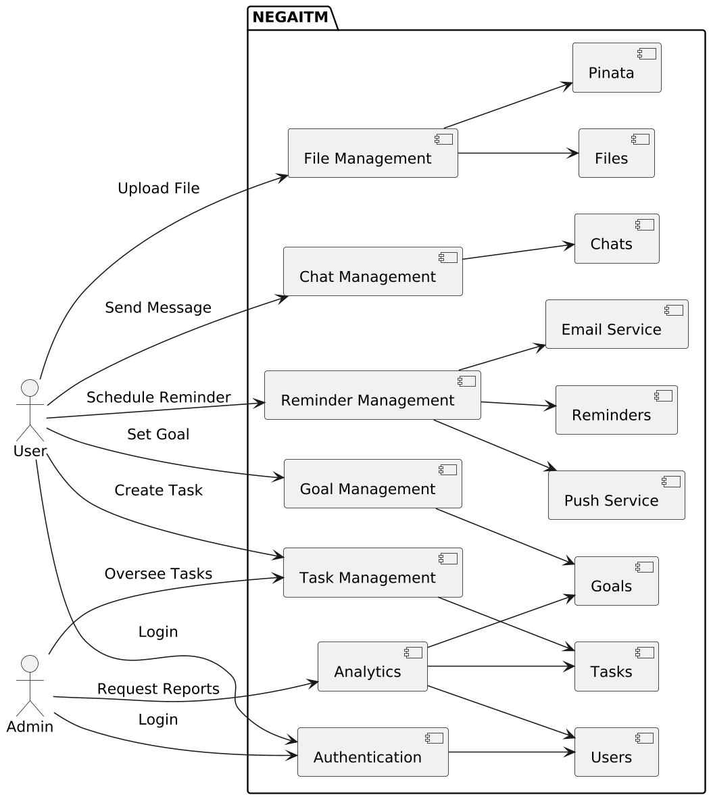
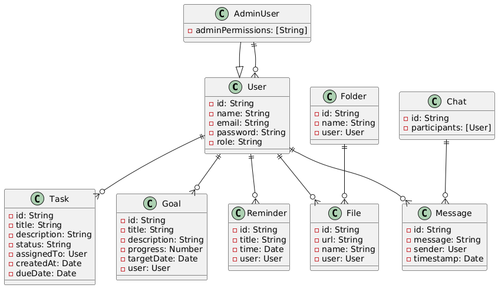
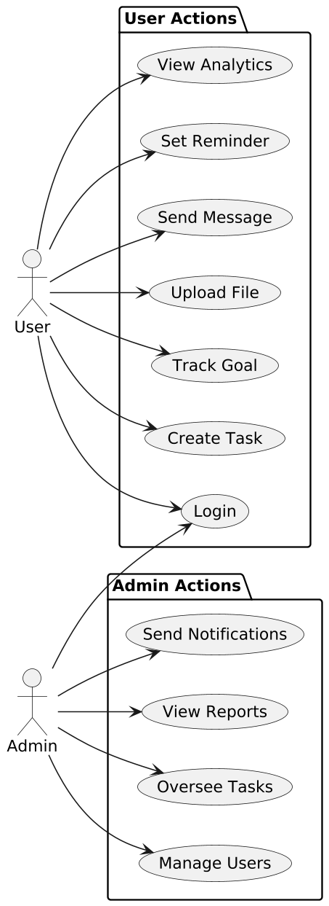
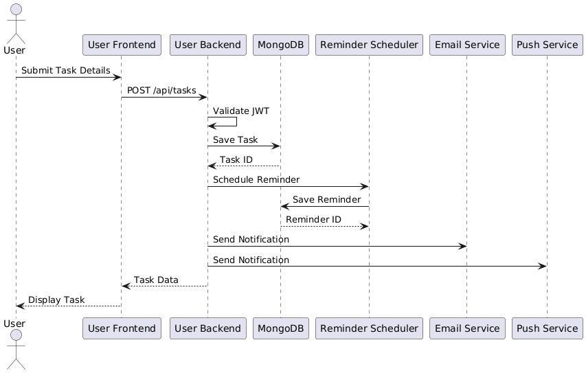
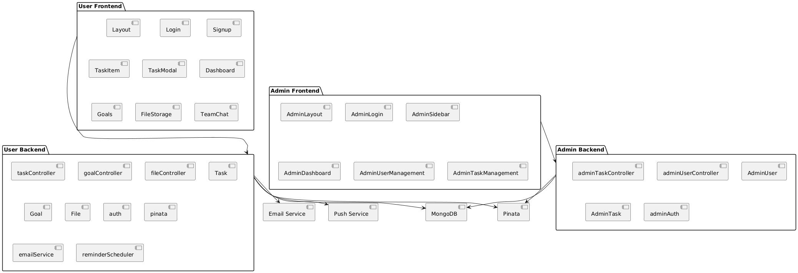

# Project Title: NEGAITM

NEGAITM is a comprehensive task management and collaboration platform designed for teams and administrators. It provides a robust set of features for task management, file storage, goal tracking, team communication, and administrative oversight. The application is divided into two main components: a user-facing frontend and backend, and an admin-specific frontend and backend, both built with modern web technologies.

This README provides a detailed overview of the project, including its structure, features, setup instructions, API documentation, and usage guidelines.

## Table of Contents
1. [Project Overview](#project-overview)
2. [Features](#features)
3. [Project Structure](#project-structure)
4. [Installation and Setup](#installation-and-setup)
5. [API Documentation](#api-documentation)
6. [Frontend Components](#frontend-components)
7. [Backend Architecture](#backend-architecture)
8. [Testing](#testing)
9. [Contributing](#contributing)
10. [License](#license)

---

## Project Overview

NEGAITM is a full-stack web application designed to streamline task management, team collaboration, and administrative operations. The platform supports both regular users and administrators, with distinct interfaces and functionalities tailored to each role. Key features include task creation and tracking, file storage with Pinata integration, goal management, team chat, reminders, and performance analytics.

The application is built using:
- **Backend**: Node.js with Express.js, MongoDB for data storage, and Jest for testing.
- **Frontend**: React.js with Vite as the build tool, Tailwind CSS for styling, and Jest for testing.
- **Additional Services**: Pinata for file pinning, email and push notification services, and a reminder scheduler.

The project is divided into two main modules:
- **Admin**: For administrative users to manage users, tasks, goals, files, and analytics.
- **User**: For team members to manage tasks, collaborate via chat, access files, and track goals.

---

## Features

### User Features
1. **Task Management**:
   - Create, update, delete, and track tasks.
   - Assign tasks to team members.
   - View tasks in various states (Pending, Complete).
   - Task modals for detailed task information.

2. **Goal Management**:
   - Set and track personal and team goals.
   - Monitor progress with visual indicators.

3. **File Storage**:
   - Upload and manage files with Pinata integration for decentralized storage.
   - Organize files in folders.

4. **Team Collaboration**:
   - Real-time team chat for communication.
   - Social feed for team updates and posts.
   - URL shortening for sharing links.

5. **Reminders**:
   - Schedule reminders for tasks and events.
   - Receive notifications via email or push.

6. **Performance Analytics**:
   - View performance metrics and task completion rates.
   - Generate reports for appraisals and team performance.

7. **Additional Tools**:
   - Calendar for scheduling meetings and deadlines.
   - AI-powered tools for task prioritization and insights.
   - Payment integration for premium features.
   - Training resources for onboarding.

### Admin Features
1. **User Management**:
   - Manage user accounts (create, update, delete).
   - Assign roles and permissions.

2. **Task and Goal Oversight**:
   - Monitor all tasks and goals across teams.
   - Assign tasks to users and track progress.

3. **File and Storage Management**:
   - Oversee file uploads and storage limits.
   - Manage folders and file access permissions.

4. **Analytics and Reporting**:
   - Generate detailed reports on user activity and task performance.
   - View analytics dashboards for insights.

5. **Chat and Bot Management**:
   - Administer team chat and bot interactions.
   - Configure automated responses for bot chats.

6. **Reminders and Notifications**:
   - Schedule and manage reminders for users.
   - Send bulk notifications via email or push.

---


...

## System Diagrams

Below are the key diagrams illustrating the architecture and design of TaskSync Pro.

### Data Flow Diagram

Illustrates how data flows between users, admins, and system components for tasks, files, and notifications.

### UML Class Diagram

Represents the data models (e.g., User, Task, Goal) and their relationships.

### UML Use Case Diagram

Shows interactions between users, admins, and the system for key functionalities.

### UML Sequence Diagram (Task Creation)

Details the sequence of interactions when a user creates a task.

### Component Diagram

Depicts the modular structure of frontend and backend components.


...


## Project Structure

```plaintext
.
├── .gitignore
├── admin
│ ├── backend
│ │ ├── __tests__
│ │ │ ├── adminTaskController.test.js
│ │ │ ├── adminUserController.test.js
│ │ │ └── authController.test.js
│ │ ├── .babelrc
│ │ ├── adminPinning
│ │ │ └── pinata.js
│ │ ├── config
│ │ │ └── adminDb.js
│ │ ├── controllers
│ │ │ ├── adminBotChatController.js
│ │ │ ├── adminController.js
│ │ │ ├── adminFileController.js
│ │ │ ├── adminFolderController.js
│ │ │ ├── adminGoalController.js
│ │ │ ├── adminStorageController.js
│ │ │ ├── adminTaskController.js
│ │ │ ├── adminUserController.js
│ │ │ └── authController.js
│ │ ├── jest.config.js
│ │ ├── jest.setup.js
│ │ ├── middleware
│ │ │ └── adminAuth.js
│ │ ├── models
│ │ │ ├── adminBotChatModel.js
│ │ │ ├── adminChatModel.js
│ │ │ ├── adminFileModel.js
│ │ │ ├── adminFolderModel.js
│ │ │ ├── adminGoalModel.js
│ │ │ ├── adminMessageModel.js
│ │ │ ├── adminModel.js
│ │ │ ├── adminPostModel.js
│ │ │ ├── adminReminderModel.js
│ │ │ ├── adminStorageLimitModel.js
│ │ │ ├── adminTaskModel.js
│ │ │ ├── adminUrls.js
│ │ │ └── adminUserModel.js
│ │ ├── package-lock.json
│ │ ├── package.json
│ │ ├── routes
│ │ │ ├── adminBotChatRoutes.js
│ │ │ ├── adminChatRoutes.js
│ │ │ ├── adminDashboardRoutes.js
│ │ │ ├── adminFileRoutes.js
│ │ │ ├── adminGoalRoutes.js
│ │ │ ├── adminPostRoutes.js
│ │ │ ├── adminReminderRoutes.js
│ │ │ ├── adminRoutes.js
│ │ │ ├── adminTaskRoutes.js
│ │ │ ├── adminUrlRoutes.js
│ │ │ └── adminUserRoutes.js
│ │ ├── server.js
│ │ └── utils
│ │ ├── adminEmailService.js
│ │ ├── adminPushService.js
│ │ └── adminReminderScheduler.js
│ └── frontend
│ ├── __tests__
│ │ ├── AdminDashboard.test.jsx
│ │ ├── AdminLogin.test.jsx
│ │ └── AdminTaskManagement.test.jsx
│ ├── .babelrc
│ ├── .gitignore
│ ├── eslint.config.js
│ ├── index.html
│ ├── jest.config.js
│ ├── jest.setup.js
│ ├── package-lock.json
│ ├── package.json
│ ├── public
│ │ └── vite.svg
│ ├── README.md
│ ├── research.txt
│ ├── src
│ │ ├── App.jsx
│ │ ├── assets
│ │ │ └── react.svg
│ │ ├── components
│ │ │ ├── AdminLayout.jsx
│ │ │ ├── AdminLogin.jsx
│ │ │ ├── AdminNavbar.jsx
│ │ │ ├── AdminProfile.jsx
│ │ │ ├── AdminSidebar.jsx
│ │ │ └── AdminSignup.jsx
│ │ ├── index.css
│ │ ├── main.jsx
│ │ └── pages
│ │ ├── AdminAnalytics.jsx
│ │ ├── AdminDashboard.jsx
│ │ ├── AdminFileManagement.jsx
│ │ ├── AdminFileStorage.jsx
│ │ ├── AdminGoalManagement.jsx
│ │ ├── AdminGoalOverview.jsx
│ │ ├── AdminReports.jsx
│ │ ├── AdminTaskManagement.jsx
│ │ ├── AdminTaskOverview.jsx
│ │ ├── AdminUserList.jsx
│ │ └── AdminUserManagement.jsx
│ └── vite.config.js
├── backend
│ ├── __tests__
│ │ ├── auth.test.js
│ │ ├── taskController.test.js
│ │ ├── taskModel.test.js
│ │ └── userController.test.js
│ ├── .babelrc
│ ├── .gitignore
│ ├── config
│ │ └── db.js
│ ├── controllers
│ │ ├── botChatController.js
│ │ ├── fileController.js
│ │ ├── folderController.js
│ │ ├── goalController.js
│ │ ├── taskController.js
│ │ └── userController.js
│ ├── jest.config.js
│ ├── jest.setup.js
│ ├── middleware
│ │ └── auth.js
│ ├── models
│ │ ├── botChatModel.js
│ │ ├── chatModel.js
│ │ ├── fileModel.js
│ │ ├── folderModel.js
│ │ ├── goalModel.js
│ │ ├── messageModel.js
│ │ ├── postModel.js
│ │ ├── reminderModel.js
│ │ ├── taskModel.js
│ │ ├── url.js
│ │ └── userModel.js
│ ├── package-lock.json
│ ├── package.json
│ ├── pinning
│ │ └── pinata.js
│ ├── routes
│ │ ├── adminRoutes.js
│ │ ├── botChatRoutes.js
│ │ ├── chatRoutes.js
│ │ ├── fileRoutes.js
│ │ ├── goalRoutes.js
│ │ ├── postRoutes.js
│ │ ├── reminderRoutes.js
│ │ ├── taskRoutes.js
│ │ ├── urlRoutes.js
│ │ └── userRoute.js
│ ├── server.js
│ └── utils
│ ├── emailService.js
│ ├── pushService.js
│ └── reminderScheduler.js
├── frontend
│ ├── __tests__
│ │ ├── Dashboard.test.jsx
│ │ ├── Goals.test.jsx
│ │ ├── TaskItem.test.jsx
│ │ └── TaskModal.test.jsx
│ ├── .babelrc
│ ├── .gitignore
│ ├── coverage
│ │ ├── clover.xml
│ │ ├── coverage-final.json
│ │ ├── lcov-report
│ │ │ ├── base.css
│ │ │ ├── block-navigation.js
│ │ │ ├── favicon.png
│ │ │ ├── index.html
│ │ │ ├── prettify.css
│ │ │ ├── prettify.js
│ │ │ ├── sort-arrow-sprite.png
│ │ │ ├── sorter.js
│ │ │ └── TaskItem.jsx.html
│ │ └── lcov.info
│ ├── eslint.config.js
│ ├── FileStorage.txt
│ ├── index.html
│ ├── intent.txt
│ ├── jest.config.js
│ ├── jest.env.js
│ ├── jest.polyfills.js
│ ├── jest.setup.js
│ ├── newColor.txt
│ ├── package-lock.json
│ ├── package.json
│ ├── public
│ │ └── vite.svg
│ ├── README.md
│ ├── Reminders.txt
│ ├── src
│ │ ├── App.jsx
│ │ ├── assets
│ │ │ ├── cssConstants.jsx
│ │ │ └── react.svg
│ │ ├── components
│ │ │ ├── Layout.jsx
│ │ │ ├── Login.jsx
│ │ │ ├── Navbar.jsx
│ │ │ ├── Profile.jsx
│ │ │ ├── Sidebar.jsx
│ │ │ ├── Signup.jsx
│ │ │ ├── TaskItem.jsx
│ │ │ └── TaskModal.jsx
│ │ ├── index.css
│ │ ├── main.jsx
│ │ └── pages
│ │ ├── AiTools.jsx
│ │ ├── Appraisals.jsx
│ │ ├── Assigned.jsx
│ │ ├── Calendar.jsx
│ │ ├── CompletePage.jsx
│ │ ├── Dashboard.jsx
│ │ ├── FileStorage.jsx
│ │ ├── GenerateReport.jsx
│ │ ├── Goals.jsx
│ │ ├── Meeting.jsx
│ │ ├── Payment.jsx
│ │ ├── PendingPage.jsx
│ │ ├── PerformanceAnalytics.jsx
│ │ ├── Reminders.jsx
│ │ ├── SocialFeed.jsx
│ │ ├── TeamChat.jsx
│ │ ├── Training.jsx
│ │ └── UrlShortener.jsx
│ └── vite.config.js
└── tree.txt


```
### Directory Descriptions
- **admin/backend**: Backend for admin functionalities, including controllers, models, routes, and utilities for user management, task oversight, and analytics.
- **admin/frontend**: Admin-specific React frontend with components and pages for dashboards, user management, and analytics.
- **backend**: Main backend for user-facing features, handling tasks, goals, files, and chats.
- **frontend**: User-facing React frontend with components and pages for task management, team collaboration, and analytics.
- **coverage**: Test coverage reports generated by Jest.
- **public**: Static assets like icons and images.
- **utils**: Utility services for email, push notifications, and reminders.

---

## Installation and Setup

### Prerequisites
- Node.js (v18 or higher)
- MongoDB (v4.4 or higher)
- npm (v7 or higher)
- Pinata account for file pinning
- Email service provider for notifications
- Push notification service (Firebase)

### Backend Setup
1. Navigate to the backend directories:
   ```bash
   cd backend
   cd admin/backend
   ```

2. Install dependencies:
   ```bash
   npm install
   ```
3. Create a `.env` file in each backend directory with the following variables:
   ```bash
   MONGO_URI=your_mongo_uri
   JWT_SECRET=your_jwt_secret
   PINATA_API_KEY=your_pinata_api_key
   PINATA_SECRET_KEY=your_pinata_secret_key
   EMAIL_SERVICE=your_email_service
   PUSH_SERVICE=your_push_service_key
   ```
4. Start the backend servers:
   ```bash
   npm start
   ```

### Frontend Setup
1. Navigate to the frontend directories:
   ```bash
   cd frontend
   cd admin/frontend
   ```
2. Install dependencies:
   ```bash
   npm install
   ```
3. Create a `.env` file in each frontend directory with:
   ```bash
   VITE_API_URL=http://localhost:4001/api
   ```
4. Start the development servers:
   ```bash
   npm run dev
   ```

### Database Setup
1. Ensure MongoDB is running locally or on a hosted service.
2. Update the `MONGO_URI` in the `.env` files to point to your MongoDB instance.

### Testing
1. Run backend tests:
   ```bash
   cd backend
   npm test
   cd admin/backend
   npm test
   ```
2. Run frontend tests:
   ```bash
   cd frontend
   npm test
   cd admin/frontend
   npm test
   ```

## API Documentation
The API is divided into two sets of endpoints: user-facing and admin-specific. All endpoints require JWT authentication unless specified otherwise.

### Authentication
- **Header**: `Authorization: Bearer <token>`
- **Token Generation**: Obtain a token via the `/auth/login` endpoint.

### User API Endpoints

#### Authentication

**POST /api/auth/login**
- **Description**: Authenticate a user and return a JWT token.
- **Request Body**:
  ```json
  {
    "email": "user@example.com",
    "password": "password123"
  }
  ```
- **Response**:
  ```json
  {
    "token": "jwt_token",
    "user": {
      "id": "user_id",
      "email": "user@example.com",
      "name": "User Name"
    }
  }
  ```
- **Errors**:
  - 401: Invalid credentials
  - 400: Missing fields

**POST /api/auth/signup**
- **Description**: Register a new user.
- **Request Body**:
  ```json
  {
    "name": "User Name",
    "email": "user@example.com",
    "password": "password123"
  }
  ```
- **Response**:
  ```json
  {
    "token": "jwt_token",
    "user": {
      "id": "user_id",
      "email": "user@example.com",
      "name": "User Name"
    }
  }
  ```
- **Errors**:
  - 400: Email already exists
  - 400: Missing fields

#### Tasks

**GET /api/tasks**
- **Description**: Retrieve all tasks for the authenticated user.
- **Response**:
  ```json
  [
    {
      "id": "task_id",
      "title": "Task Title",
      "status": "pending",
      "assignedTo": "user_id",
      "createdAt": "2025-07-14T08:20:00Z"
    }
  ]
  ```
- **Errors**:
  - 401: Unauthorized

**POST /api/tasks**
- **Description**: Create a new task.
- **Request Body**:
  ```json
  {
    "title": "Task Title",
    "description": "Task Description",
    "assignedTo": "user_id",
    "dueDate": "2025-07-20"
  }
  ```
- **Response**:
  ```json
  {
    "id": "task_id",
    "title": "Task Title",
    "status": "pending",
    "assignedTo": "user_id",
    "createdAt": "2025-07-14T08:20:00Z"
  }
  ```
- **Errors**:
  - 400: Missing fields
  - 401: Unauthorized

**PUT /api/tasks/:id**
- **Description**: Update a task.
- **Request Body**:
  ```json
  {
    "title": "Updated Task Title",
    "status": "completed"
  }
  ```
- **Response**:
  ```json
  {
    "id": "task_id",
    "title": "Updated Task Title",
    "status": "completed"
  }
  ```
- **Errors**:
  - 404: Task not found
  - 401: Unauthorized

**DELETE /api/tasks/:id**
- **Description**: Delete a task.
- **Response**:
  ```json
  {
    "message": "Task deleted"
  }
  ```
- **Errors**:
  - 404: Task not found
  - 401: Unauthorized

#### Goals

**GET /api/goals**
- **Description**: Retrieve all goals for the authenticated user.
- **Response**:
  ```json
  [
    {
      "id": "goal_id",
      "title": "Goal Title",
      "progress": 50,
      "createdAt": "2025-07-14T08:20:00Z"
    }
  ]
  ```
- **Errors**:
  - 401: Unauthorized

**POST /api/goals**
- **Description**: Create a new goal.
- **Request Body**:
  ```json
  {
    "title": "Goal Title",
    "description": "Goal Description",
    "targetDate": "2025-12-31"
  }
  ```
- **Response**:
  ```json
  {
    "id": "goal_id",
    "title": "Goal Title",
    "progress": 0,
    "createdAt": "2025-07-14T08:20:00Z"
  }
  ```
- **Errors**:
  - 400: Missing fields
  - 401: Unauthorized

#### Files

**POST /api/files/upload**
- **Description**: Upload a file to Pinata.
- **Request Body**: Form-data with file field.
- **Response**:
  ```json
  {
    "id": "file_id",
    "url": "https://pinata.cloud/ipfs/file_hash",
    "name": "filename.pdf"
  }
  ```
- **Errors**:
  - 400: No file uploaded
  - 401: Unauthorized

**GET /api/files**
- **Description**: List all files for the authenticated user.
- **Response**:
  ```json
  [
    {
      "id": "file_id",
      "url": "https://pinata.cloud/ipfs/file_hash",
      "name": "filename.pdf"
    }
  ]
  ```
- **Errors**:
  - 401: Unauthorized

#### Chat

**GET /api/chats**
- **Description**: Retrieve all chat messages for the authenticated user.
- **Response**:
  ```json
  [
    {
      "id": "chat_id",
      "message": "Hello team!",
      "sender": "user_id",
      "timestamp": "2025-07-14T08:20:00Z"
    }
  ]
  ```
- **Errors**:
  - 401: Unauthorized

**POST /api/chats**
- **Description**: Send a chat message.
- **Request Body**:
  ```json
  {
    "message": "Hello team!"
  }
  ```
- **Response**:
  ```json
  {
    "id": "chat_id",
    "message": "Hello team!",
    "sender": "user_id",
    "timestamp": "2025-07-14T08:20:00Z"
  }
  ```
- **Errors**:
  - 400: Missing message
  - 401: Unauthorized

#### Reminders

**POST /api/reminders**
- **Description**: Schedule a reminder.
- **Request Body**:
  ```json
  {
    "title": "Meeting Reminder",
    "time": "2025-07-15T10:00:00Z"
  }
  ```
- **Response**:
  ```json
  {
    "id": "reminder_id",
    "title": "Meeting Reminder",
    "time": "2025-07-15T10:00:00Z"
  }
  ```
- **Errors**:
  - 400: Missing fields
  - 401: Unauthorized

### Admin API Endpoints

#### User Management

**GET /api/admin/users**
- **Description**: Retrieve all users (admin only).
- **Response**:
  ```json
  [
    {
      "id": "user_id",
      "name": "User Name",
      "email": "user@example.com",
      "role": "user"
    }
  ]
  ```
- **Errors**:
  - 403: Forbidden (non-admin)
  - 401: Unauthorized

**PUT /api/admin/users/:id**
- **Description**: Update user details (admin only).
- **Request Body**:
  ```json
  {
    "role": "admin",
    "name": "Updated Name"
  }
  ```
- **Response**:
  ```json
  {
    "id": "user_id",
    "name": "Updated Name",
    "role": "admin"
  }
  ```
- **Errors**:
  - 404: User not found
  - 403: Forbidden
  - 401: Unauthorized

#### Task Management

**GET /api/admin/tasks**
- **Description**: Retrieve all tasks across users (admin only).
- **Response**:
  ```json
  [
    {
      "id": "task_id",
      "title": "Task Title",
      "status": "pending",
      "assignedTo": "user_id"
    }
  ]
  ```
- **Errors**:
  - 403: Forbidden
  - 401: Unauthorized

#### Analytics

**GET /api/admin/analytics**
- **Description**: Retrieve performance analytics (admin only).
- **Response**:
  ```json
  {
    "totalTasks": 100,
    "completedTasks": 70,
    "activeUsers": 50
  }
  ```
- **Errors**:
  - 403: Forbidden
  - 401: Unauthorized

## Frontend Components

### User Frontend

**Components**:
- `Layout.jsx`: Main layout with navbar and sidebar.
- `Login.jsx`: User login page.
- `Signup.jsx`: User registration page.
- `TaskItem.jsx`: Component for displaying individual tasks.
- `TaskModal.jsx`: Modal for task details and editing.

**Pages**:
- `Dashboard.jsx`: Overview of tasks and goals.
- `Goals.jsx`: Goal creation and tracking.
- `FileStorage.jsx`: File upload and management.
- `TeamChat.jsx`: Real-time chat interface.
- `PerformanceAnalytics.jsx`: Visual analytics for user performance.

### Admin Frontend

**Components**:
- `AdminLayout.jsx`: Admin-specific layout.
- `AdminLogin.jsx`: Admin login page.
- `AdminSidebar.jsx`: Navigation for admin features.

**Pages**:
- `AdminDashboard.jsx`: Admin overview of system metrics.
- `AdminUserManagement.jsx`: Interface for managing users.
- `AdminTaskManagement.jsx`: Task oversight and assignment.
- `AdminAnalytics.jsx`: Detailed analytics and reporting.

## Backend Architecture

### Models
- **User Models** (`userModel.js`, `adminUserModel.js`): Store user data, roles, and authentication details.
- **Task Models** (`taskModel.js`, `adminTaskModel.js`): Manage task data, including status and assignments.
- **Goal Models** (`goalModel.js`, `adminGoalModel.js`): Track goal progress and deadlines.
- **File Models** (`fileModel.js`, `adminFileModel.js`): Handle file metadata and Pinata integration.

### Controllers
- **User Controllers**: Handle business logic for tasks, goals, files, and chats.
- **Admin Controllers**: Extend user controllers with additional logic for user management and analytics.

### Routes
- **User Routes**: Define endpoints for user-facing features.
- **Admin Routes**: Define endpoints for admin-specific functionalities, protected by `adminAuth.js` middleware.

### Middleware
- `auth.js`: JWT authentication for user endpoints.
- `adminAuth.js`: Additional role-based authorization for admin endpoints.

### Utilities
- **Pinata Integration** (`pinata.js`): Handles file uploads to IPFS via Pinata.
- **Email and Push Services** (`emailService.js`, `pushService.js`): Manage notifications.
- **Reminder Scheduler** (`reminderScheduler.js`): Schedules and triggers reminders.

## Testing
The project includes comprehensive unit and integration tests using Jest.

### Backend Tests
- Located in `backend/__tests__` and `admin/backend/__tests__`.
- Cover authentication, task management, and user controllers.
- Run with:
  ```bash
  npm test
  ```

### Frontend Tests
- Located in `frontend/__tests__` and `admin/frontend/__tests__`.
- Cover key components like dashboards and task management.
- Run with:
  ```bash
  npm test
  ```

## Contributing
1. Fork the repository.
2. Create a feature branch (`git checkout -b feature/YourFeature`).
3. Commit changes (`git commit -m "Add YourFeature"`).
4. Push to the branch (`git push origin feature/YourFeature`).
5. Open a pull request.

Please follow the code style defined in `eslint.config.js` and ensure tests pass before submitting.

```
